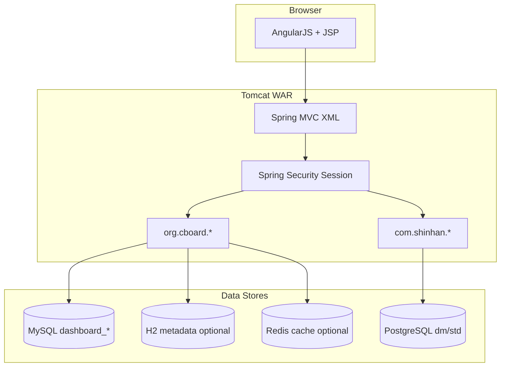

# BDP 프로젝트 현황 평가 (심각성 · 기술 · 개발 상태)

> 작성 기준: 레포 `/workspace` 정적 분석 (2026-05-20)  
> 목적: 리빌딩 에이전트가 의사결정할 수 있는 **위험도·기술 부채·운영 가능성** 정리

---

## 1. 프로젝트 개요

| 항목 | 내용 |
|------|------|
| 아티팩트 | `com.bdp:bdp` (Maven WAR) |
| 기반 | [CBoard](https://github.com/yzhang1984/CBoard) 오픈소스 BI 대시보드 포크 |
| 커스텀 | `com.shinhan.*` — 키워드/트렌드/문서 인사이트, GA, 리포트 API |
| 프론트 | AngularJS 1.x + AdminLTE (JSP 혼합) |
| 메타 DB | MySQL 또는 H2 (`dashboard_*` 테이블) |
| 분석 DB | **PostgreSQL** (`dm.*`, `std.*` 스키마, MyBatis XML) |
| 규모 | Java ~179개, webapp JS ~564개, 저장소 ~86MB |

**핵심 결론:** “빅데이터 플랫폼” 컨셉은 **CBoard(시각화·메타)** + **PostgreSQL DW(집계·NLP 결과)** 이중 구조이나, **로컬 단독 실행·현대 보안·테스트·배포 자동화는 사실상 불가**에 가깝다.

---

## 2. 심각도 매트릭스

| 영역 | 등급 | 근거 |
|------|------|------|
| **보안 (CVE·자격증명)** | 🔴 Critical | EOL 스택, CSRF 비활성, 평문/약한 암호화, `pom.xml`에 Tomcat 배포 URL·계정, Jasypt 마스터 비밀번호 하드코딩 |
| **빌드·실행 가능성** | 🔴 Critical | README 비어 있음, 외부 MySQL·PostgreSQL 필수, `mvn` 미설치 시 즉시 실패, H2 프로필은 CBoard 메타만 |
| **유지보수성** | 🟠 High | XML 기반 Spring 4, 거대 MyBatis XML(2천+ 라인), `@ComponentScan` 패키지 오타 |
| **테스트·품질** | 🔴 Critical | 단위 테스트 2개, CI/CD 없음, 컨트롤러·비즈니스 테스트 0 |
| **프론트 기술 부채** | 🟠 High | AngularJS EOL, vendor 번들 수백 개, React/Vite 전환 필수 |
| **데이터·이식성** | 🟠 High | PostgreSQL 전용 SQL(`array_position`, `::DATE`, `row_number() over`) — H2/다른 DB로 그대로 이전 불가 |
| **라이선스·거버넌스** | 🟡 Medium | CBoard + 신한 커스텀 혼재, 문서·API 스펙 부재 |

---

## 3. 기술 스택 문제 (상세)

### 3.1 백엔드 — EOL 및 알려진 취약점

| 구성요소 | 현재 버전 | 권장(리빌드) | 리스크 |
|----------|-----------|--------------|--------|
| Java | 8 | 21 LTS | 언어/라이브러리 미지원 |
| Spring Framework | 4.3.7 | 6.x (Boot 3.4+) | CVE 다수, Servlet 6 미호환 |
| Spring Security | 4.1.0 | 6.x + JWT | 세션·SHA-256 인코더 구식 |
| MyBatis | 3.1.1 / spring 1.1.1 | JPA + QueryDSL(선택) | XML 유지보수 비용 |
| Log4j | **1.2.17** | Logback (Boot 기본) | Log4Shell 계열 |
| Fastjson | 1.2.29 | Jackson 2.17+ | 역직렬화 CVE 이력 |
| Jackson | 2.8.1 | 2.17+ | 다수 CVE |
| Commons Collections | 3.2.1 | 4.x | 역직렬화 이슈 |
| Tomcat (plugin) | 7.0.52 | Embedded Tomcat 10+ | HTTP/2·보안 패치 없음 |
| H2 | 1.4.196 | 2.2.x | 구버전 |
| Presto JDBC | 0.161 | 최신 또는 제거 | 매우 구버전 |

### 3.2 아키텍처 이슈



- **듀얼 데이터소스:** CBoard CRUD는 `dashboard_*`, 인사이트 API는 **반드시 PostgreSQL**.
- **환경 스위칭:** `env` Maven 프로필로 `src/main/resources/${env}` 복사 — 표준 Spring Profile 패턴 아님.
- **ComponentScan 버그:** `WebConfig`에서 `basePackages = {"org.cboard.controller, com.shinhan.ctrl"}` → **쉼표가 패키지 이름에 포함**되어 `com.shinhan.ctrl` 스캔 실패 가능.

```18:18:src/main/java/org/cboard/controller/WebConfig.java
@ComponentScan(basePackages = {"org.cboard.controller, com.shinhan.ctrl"})
```

### 3.3 보안 문제

| 이슈 | 위치/증상 | 영향 |
|------|-----------|------|
| CSRF 비활성 | `spring-security-jdbc.xml` | 세션 하이재킹·CSRF |
| SHA-256 단방향 (salt 없는 구식 Encoder) | `ShaPasswordEncoder` | 레인보우 테이블·약한 정책 |
| 기본 admin 비밀번호 해시 | `sql/mysql/mysql.sql` | 초기 침해 |
| Jasypt password `111111` | `spring-datasource.xml` | DB 자격증명 복호화 가능 |
| Tomcat manager URL·계정 | `pom.xml` tomcat-maven-plugin | **저장소에 배포 자격증명 노출** |
| JWT 없음 | 세션 + form login | SPA·모바일·다중 서비스 연동 곤란 |

### 3.4 프론트엔드

- AngularJS **1.x (EOL 2022)** — 보안 패치 없음.
- `src/main/webapp/cboard` 하위 **수천 개 정적 자산** (플러그인, dist, lib).
- API는 REST이나 인증은 **쿠키 세션** — React SPA 전환 시 CORS·JWT 재설계 필수.

### 3.5 테스트·DevOps

- 테스트: `ConfigComponentTest`, `ServiceStatusTest` **2개뿐**.
- GitHub Actions / Dockerfile / docker-compose **없음**.
- README **비어 있음** → 온보딩 불가.

---

## 4. 개발 상태 문제

| 문제 | 설명 |
|------|------|
| 문서 부재 | API 목록, ERD, 배포 절차, 환경 변수 정의 없음 |
| 도메인 결합 | `ParamVO` + MyBatis XML에 비즈니스 규칙·PostgreSQL 문법 혼재 |
| 하드코딩 FID | `ReportCtrl` 등 특정 `fid` 분기 (`BDPC04030305` 등) |
| 신한/ CBoard 경계 불명확 | 패키지·매퍼·보안 규칙이 한 WAR에 혼재 |
| PostgreSQL 미연결 시 | `/report`, `/ga`, `/cus` API 전부 실패 — **graceful degradation 없음** |

---

## 5. 리빌딩 시 반드시 해결할 항목 (요약)

1. **Gradle + Spring Boot 3.4 + Java 21** 단일 실행 JAR
2. **Flyway + H2** 로 메타·분석 스키마 시드 → `clone && ./gradlew bootRun`
3. **JWT** (Access/Refresh), BCrypt, CSRF는 API stateless 기준으로 재설계
4. **JPA** — `dashboard_*` 엔티티, 분석 테이블은 JPA 또는 Spring Data JDBC
5. **React 19 + Vite** SPA, OpenAPI 계약
6. **테스트** — 컨트롤러 MockMvc + 서비스 + Repository (목표 커버리지 80%+)
7. **마이그레이션 가이드** — Python(FastAPI), Node(NestJS) (별도 문서)
8. **Open API 크롤링·적재** 파이프라인 설계 (별도 문서)
9. **ECS/EC2** 배포 템플릿 (별도 문서)

---

## 6. 리빌드 산출물 위치

| 문서 | 경로 |
|------|------|
| 로드맵 | [02-REBUILD_ROADMAP.md](./02-REBUILD_ROADMAP.md) |
| 예측 ERD | [03-ERD_PREDICTION.md](./03-ERD_PREDICTION.md) |
| Python 마이그레이션 | [04-MIGRATION_PYTHON.md](./04-MIGRATION_PYTHON.md) |
| Node 마이그레이션 | [05-MIGRATION_NODE.md](./05-MIGRATION_NODE.md) |
| Open API·크롤링 | [06-OPEN_DATA_AND_CRAWLING.md](./06-OPEN_DATA_AND_CRAWLING.md) |
| AWS 배포 | [07-AWS_DEPLOYMENT.md](./07-AWS_DEPLOYMENT.md) |
| 신규 코드 | [`/bdp-next`](../bdp-next/README.md) |

---

## 7. 최종 판정

**리빌딩 권장 (Refactor-in-place 비권장).**  
현 코드베이스는 운영 레거시로 보존하고, `bdp-next`에서 **계약(API)·스키마·인증**을 먼저 고정한 뒤 기능을 단계적으로 이전하는 것이 비용 대비 리스크가 가장 낮다.
