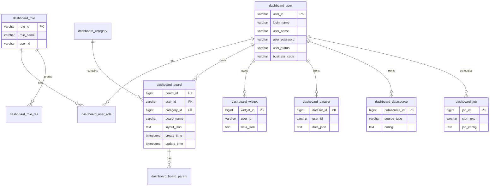
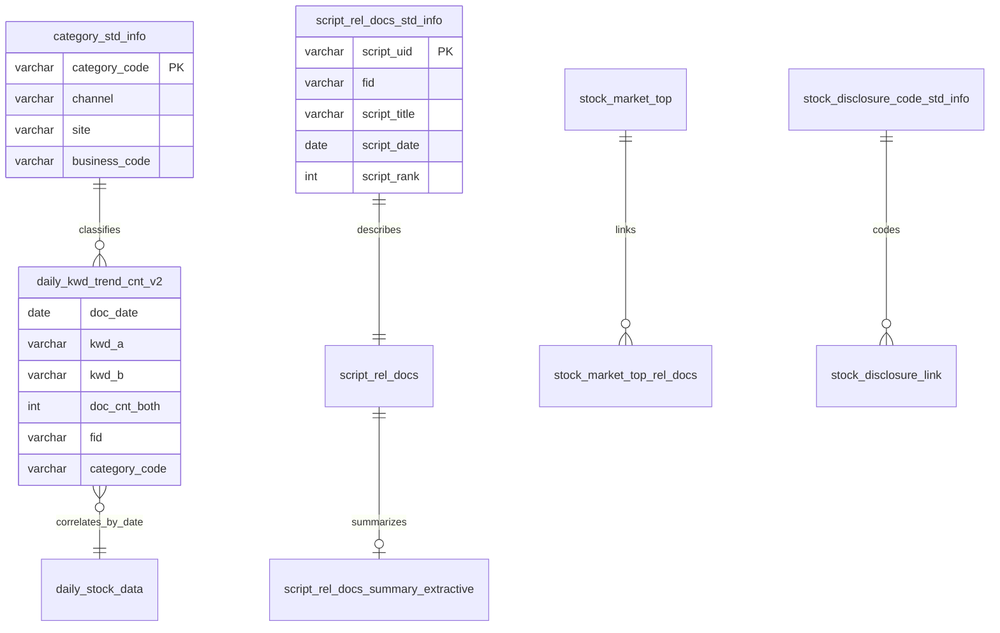

# 쿼리 기반 ERD 예측

MyBatis XML(`src/main/resources/mapper/report/*.xml`, CBoard `sql/mysql/mysql.sql`)을 역추적한 **논리 ERD**입니다.  
PostgreSQL에서 `dm`(Data Mart), `std`(Standard) 스키마로 분리되어 있습니다.

---

## 1. CBoard 메타데이터 (H2/MySQL 호환)

> `business_code` 컬럼은 `UserDao.xml` 커스텀에서 사용 — 기본 `mysql.sql`에는 없을 수 있어 Flyway에서 추가.

---

## 2. 분석 웨어하우스 (PostgreSQL — 리빌드 시 H2로 단순화)

### 2.1 키워드 트렌드 계열

공통 grain: `(fid, business_code, category_code, doc_date, kwd_a, kwd_b)`

| 테이블 | 용도 |
|--------|------|
| `dm.daily_kwd_trend_cnt_v2` | 일별 키워드 co-occurrence |
| `dm.daily_kwd_trend_cnt_minimal_v2` | 경량 집계 (트렌드 차트 주 사용) |
| `dm.weekly_kwd_trend_cnt_v2` / `_minimal_v2` | 주별 |
| `dm.monthly_*` | 월별 |
| `dm.quarterly_*` | 분기 |
| `dm.yearly_*` | 연별 |

**예상 컬럼:** `kwd_a`, `kwd_b`, `doc_date`, `doc_cnt_a`, `doc_cnt_b`, `doc_cnt_both`, `pos_cnt_both`, `neg_cnt_both`, `neu_cnt_both`, `fid`, `business_code`, `category_code`

### 2.2 감성·연관

| 테이블 | 용도 |
|--------|------|
| `dm.daily_doc_sentiment_pie_data` | 감성 파이 (일/주/월/분기/년 버전 존재) |
| `dm.daily_doc_sentiment_ext_co_word` | 동시출현 확장 |
| `dm.daily_doc_sentiment_ext_flat_word` | 플랫 워드 |
| `dm.daily_kwd_asso_market` | 시장 연관 키워드 (주기별 `_market` 테이블) |

### 2.3 문서·스크립트

| 테이블 | 용도 |
|--------|------|
| `dm.script_rel_docs_std_info` | 스크립트 표준 메타 (alias `std` in query) |
| `dm.script_rel_docs` | 원문 링크 |
| `dm.script_rel_docs_summary_extractive` | 추출 요약 |
| `dm.doc_loc` | 채널별 확산 위치 |
| `dm.stock_market_top` | 시장 브리핑 상위 |
| `dm.stock_market_top_rel_docs` | 관련 문서 |

### 2.4 시장·종목

| 테이블 | 용도 |
|--------|------|
| `dm.daily_stock_data` | 일별 주가 |
| `dm.near_realtime_stock_data` | 준실시간 시세 |
| `dm.stock_disclosure_link` | 공시 링크 |
| `dm.stock_expert_report` | 전문가 리포트 |
| `std.category_std_info` | 채널·사이트·카테고리 표준 |
| `std.stock_disclosure_code_std_info` | 공시 코드 표준 |

---

## 3. 엔티티 관계 (분석 도메인)

---

## 4. H2 로컬 구현 전략 (`bdp-next`)

| PostgreSQL | H2 대응 |
|------------|---------|
| `dm.*`, `std.*` | 스키마 없이 단일 DB, 테이블명 동일 또는 `DM_` prefix |
| `array_position(ARRAY[...], col)` | `ARRAY_POSITION` (H2 2.x) 또는 애플리케이션 정렬 |
| `::DATE`, `::varchar[]` | `CAST(... AS DATE)` |
| `row_number() OVER` | 지원 (H2 2.x) |

Flyway 마이그레이션: `bdp-next/backend/src/main/resources/db/migration/`

---

## 5. API ↔ 테이블 매핑

| API prefix | 주요 테이블 |
|------------|-------------|
| `/report/*` | `daily_kwd_trend_cnt_*`, `script_rel_docs_*`, `stock_*` |
| `/cus/*` | 동일 + 고객사 커스텀 필터 |
| `/ga/*` | GA 집계 (별도 mapper) |
| `/cboard/dashboard/*` | `dashboard_*` |
