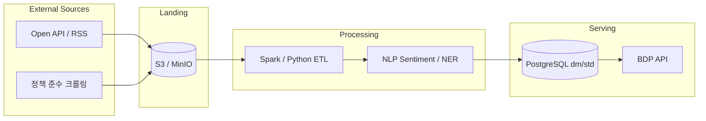

# Open API · 크롤링 · 빅데이터 적재 아이디어

BDP(빅데이터 플랫폼) 컨셉에 맞춘 **외부 데이터 소스**와 **적재 파이프라인** 제안입니다.  
현 레거시는 이미 `dm.*` 키워드·감성·종목·공시 도메인을 전제로 하므로, 아래 소스는 **스키마 확장** 또는 **신규 mart 테이블**로 설계합니다.

---

## 1. 데이터 도메인 맵



---

## 2. 한국 — 금융·시장 (레거시 `stock_*`, `disclosure` 연계)

| 소스 | API/데이터 | 적재 테이블(제안) | 용도 |
|------|------------|-------------------|------|
| **금융감독원 Open DART** | 공시 검색·재무제표 API | `dm.stock_disclosure_link`, `dm.financial_facts` | 공시 링크·재무 KPI 위젯 |
| **KRX 정보데이터시스템** | 시세·지수 (승인 필요) | `dm.daily_stock_data`, `dm.near_realtime_stock_data` | 시장 브리핑·연관종목 |
| **한국은행 ECOS** | 금리·환율·경제지표 | `dm.macro_indicator` | 거시 트렌드 대시보드 |
| **FSS 금융통계** | 은행·카드 통계 | `dm.fss_stat` | 산업 비교 |
| **KOSCOM (계약)** | 실시간 시세 | `near_realtime_stock_data` | 준실시간 차트 |

---

## 3. 뉴스·텍스트·키워드 (레거시 `kwd_*`, `script_*` 연계)

| 소스 | 방식 | 적재 | NLP 파이프라인 |
|------|------|------|----------------|
| **네이버 뉴스 검색 API** | Open API | `raw.news_article` | 키워드 추출 → `daily_kwd_trend_cnt_*` |
| **Google News RSS** | RSS | 동일 | 감성 → `*_doc_sentiment_*` |
| **공공데이터포털** 뉴스/보도자료 | API | `std.category_std_info` 채널 매핑 | |
| **Reddit/HN** (글로벌) | 공식 API | `dm.social_mention` | 트렌드 비교 |

**크롤링 주의:** robots.txt·이용약관 준수. 가능하면 **공식 API 우선**.

---

## 4. 기업·산업 메타

| 소스 | 데이터 | 테이블 |
|------|--------|--------|
| **OPENDART corp_code** | 회사 고유번호 | `std.company_master` |
| **공공데이터 산업분류** | KSIC | `category_std_info` |
| **Wikidata / DBpedia** | 엔티티 링크 | `std.entity_alias` |

---

## 5. Open API 통합 아키텍처 (신규)

```
ingestion/
├── connectors/
│   ├── dart_connector.py
│   ├── ecos_connector.py
│   └── news_connector.py
├── scheduler/          # Quartz 대체: Spring @Scheduled or Airflow
├── normalizer/         # JSON → canonical model
└── loader/             # JDBC bulk / COPY
```

**스케줄 예:**
- 일 1회: DART 공시, ECOS 거시지표
- 5분: KRX 지연 시세 (라이선스 허용 시)
- 시간: 뉴스 API

---

## 6. 빅데이터 확장 (선택)

| 단계 | 기술 | 용도 |
|------|------|------|
| Raw | S3 + Parquet | 원본 보존 |
| Process | Spark on EMR / Glue | 대용량 co-occurrence |
| OLAP | ClickHouse / Presto (레거시에 Presto JDBC 존재) | ad-hoc |
| Serve | PostgreSQL mart | API 응답 < 500ms |

레거시 `presto-jdbc`, `kylin-jdbc` 의존성은 **Phase 3**에서 “필요 시만” 재도입.

---

## 7. 샘플 적재 스키마 (신규)

```sql
CREATE TABLE raw_api_fetch_log (
  id BIGSERIAL PRIMARY KEY,
  source_code VARCHAR(50),
  fetched_at TIMESTAMP,
  status VARCHAR(20),
  row_count INT,
  payload_s3_key VARCHAR(500)
);

CREATE TABLE dm.macro_indicator (
  indicator_code VARCHAR(50),
  ref_date DATE,
  value DECIMAL(18,4),
  unit VARCHAR(20),
  PRIMARY KEY (indicator_code, ref_date)
);
```

---

## 8. MVP 우선순위 (리빌드 Phase 3)

1. **Open DART** 공시 목록 → `stock_disclosure_link` 호환 뷰
2. **ECOS** 환율·기준금리 → 신규 macro 대시보드
3. **뉴스 API** 일 100건 → 키워드 트렌드 시드 (H2 데모용 synthetic + 소량 실데이터)

---

## 9. 법·컴플라이언스 체크리스트

- [ ] API 키 Secrets Manager 저장
- [ ] 개인정보 미수집·마스킹
- [ ] 출처·저작권 표기 (대시보드 footer)
- [ ] Rate limit·캐시로 호출 비용 통제
- [ ] 크롤링 시 사이트별 약관 검토

---

## 10. CBoard 연동

수집 데이터는 **Datasource**로 등록:
- `source_type`: `jdbc` / `textfile` / 향후 `api`
- Widget/Dataset JSON은 기존 CBoard 포맷 유지 → React에서 동일 메타 API 소비
