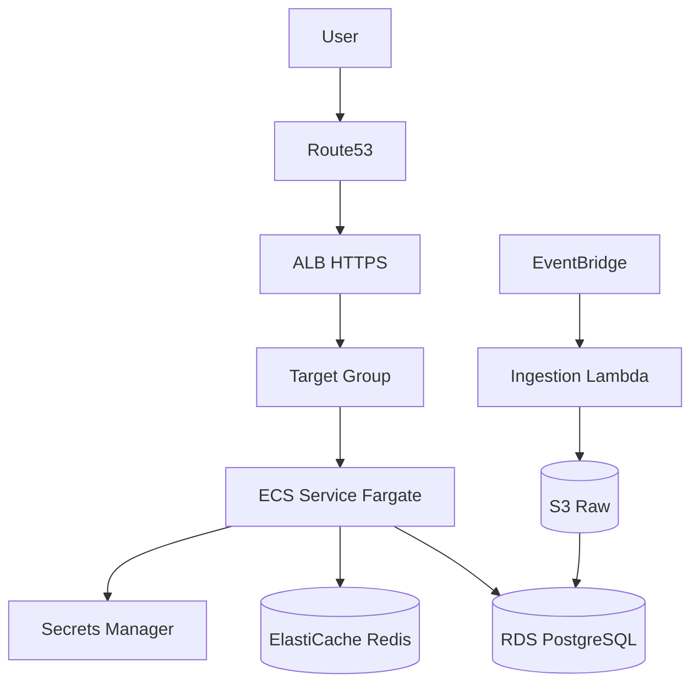

# AWS 배포 가이드 (ECS · EC2)

`insight-board` Spring Boot JAR + React 정적 파일 기준입니다.

---

## 1. 배포 옵션 비교

| 방식 | 장점 | 단점 | 권장 |
|------|------|------|------|
| **ECS Fargate** | 서버 관리 없음, 오토스케일 | 콜드스타트·비용 | ✅ 프로덕션 기본 |
| **EC2 + Docker** | 레거시 Tomcat 습관, SSH 디버그 | 패치·스케일 수동 | 스테이징·POC |
| **Elastic Beanstalk** | 빠른 POC | 커스터마이즈 제한 | 데모 |

---

## 2. 아키텍처 (ECS)



---

## 3. 컨테이너 빌드

`insight-board/backend/Dockerfile` (개념):

```dockerfile
FROM eclipse-temurin:21-jre-alpine AS runtime
WORKDIR /app
COPY build/libs/insight-board-*.jar app.jar
ENV SPRING_PROFILES_ACTIVE=prod
EXPOSE 8080
ENTRYPOINT ["java","-jar","/app/app.jar"]
```

React는:
- **옵션 A:** `npm run build` → JAR `static/` 포함
- **옵션 B:** S3 + CloudFront (권장 프로덕션)

---

## 4. ECS Fargate 체크리스트

1. **ECR** 리포지토리 생성 → CI에서 push
2. **Task Definition**
   - CPU 512 / Memory 1024 (시작)
   - `secrets`: `JWT_SECRET`, `SPRING_DATASOURCE_PASSWORD`
   - Health: `GET /actuator/health`
3. **Service** + ALB listener 443
4. **RDS PostgreSQL 16** — Flyway migrate on deploy
5. **Security Group:** ALB→ECS만 8080, ECS→RDS 5432

---

## 5. EC2 배포 (대안)

```bash
# EC2 Amazon Linux 2023
sudo yum install -y docker
sudo systemctl enable docker
aws ecr get-login-password | docker login ...
docker run -d -p 8080:8080 \
  -e SPRING_PROFILES_ACTIVE=prod \
  -e SPRING_DATASOURCE_URL=jdbc:postgresql://... \
  <ecr-uri>/insight-board:latest
```

- **Nginx** reverse proxy + Let's Encrypt
- **systemd** unit으로 컨테이너 재시작

---

## 6. 환경 변수

| 변수 | 설명 |
|------|------|
| `SPRING_PROFILES_ACTIVE` | `prod` |
| `SPRING_DATASOURCE_URL` | RDS JDBC |
| `JWT_SECRET` | 256bit+ random |
| `CORS_ALLOWED_ORIGINS` | CloudFront 도메인 |

---

## 7. CI/CD (GitHub Actions 개요)

```yaml
jobs:
  build:
    runs-on: ubuntu-latest
    steps:
      - uses: actions/checkout@v4
      - uses: actions/setup-java@v4
        with: { java-version: '21' }
      - run: cd insight-board/backend && ./gradlew test bootJar
      - run: docker build -t $ECR_REPO:$GITHUB_SHA .
      - run: docker push $ECR_REPO:$GITHUB_SHA
      - run: aws ecs update-service --cluster bdp --force-new-deployment
```

---

## 8. 레거시 Tomcat 마이그레이션

| 레거시 | 신규 |
|--------|------|
| WAR + Tomcat 7 | Executable JAR Boot 3 |
| `tomcat-maven-plugin` IP 배포 | ECS rolling update |
| Jasypt `111111` | Secrets Manager |

**주의:** `pom.xml`에 있던 Tomcat Manager 자격증명은 **즉시 로테이션**.

---

## 9. 비용·모니터링

- CloudWatch Logs ← `logback-spring.xml` JSON
- X-Ray 또는 Micrometer → Prometheus (선택)
- RDS: `db.t4g.medium` 시작, Read Replica는 리포트 부하 시

---

## 10. 로컬 → AWS 전환 순서

1. Docker Compose (Postgres + app) 로컬 검증
2. ECR + ECS 스테이징
3. RDS 스냅샷 마이그레이션 (레거시 PG → 신규)
4. Route53 cutover
5. 레거시 EC2 Tomcat drain
