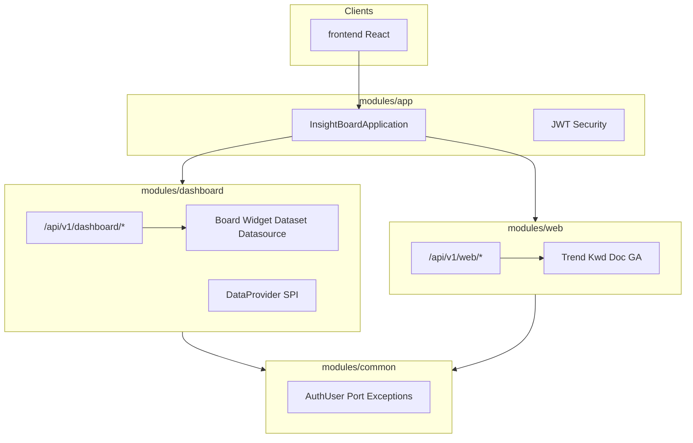

# 리빌드 방향 v2 — 모듈 분리 · CBoard 최신화 · Spring Boot 4

> 전제: [01-PROJECT_ASSESSMENT.md](./01-PROJECT_ASSESSMENT.md), [02-REBUILD_ROADMAP.md](./02-REBUILD_ROADMAP.md)  
> 추가 요구: **dashboard(CBoard) / web(신한) 모듈 분리**, **CBoard 보안 검증**, **Spring Boot 4.x 의견**

---

## 1. 모듈 아키텍처 (핵심 결정)

### 1.1 명명·경계

| 레거시 | 신규 모듈 | 책임 |
|--------|-----------|------|
| `org.cboard.*` | **`dashboard`** | BI 메타·시각화: board, widget, dataset, datasource, job, role, category, DataProvider SPI |
| `com.shinhan.*` | **`web`** | 인사이트·리포트·GA: trend/kwd/doc 테이블 조회, `/report`, `/ga`, `/cus` API |
| (없음) | **`app`** | Spring Boot 진입점, Security(JWT), OpenAPI, 프로필, 모듈 조립 |
| (공통) | **`common`** | 공유 DTO·예외·유저 컨텍스트·유틸 (프레임워크 의존 최소) |

**원칙**

- `dashboard`는 `web`에 **의존하지 않음** (단방향: `app` → `dashboard`, `app` → `web`).
- `web`은 사용자·권한이 필요하면 `common`의 포트(interface)만 사용 (구현은 `app` 또는 `dashboard`).
- DB는 물리적으로 분리 가능: `dashboard` → 메타(H2/MySQL), `web` → 분석(PostgreSQL). 로컬은 H2 스키마 2개 또는 스키마 prefix로 공존.

### 1.2 Gradle 멀티모듈 (목표 트리)

```
insight-board/
├── settings.gradle.kts
├── build.gradle.kts                 # 공통 convention (Java 21, 테스트, OWASP)
├── modules/
│   ├── common/                      # java-library
│   ├── dashboard/                   # java-library (구 CBoard)
│   ├── web/                         # java-library (구 shinhan)
│   └── app/                         # boot application
├── frontend/                        # React SPA (dashboard UI + web 인사이트 화면)
└── docs/
```



### 1.3 API prefix 정리 (레거시 호환)

| 레거시 | 신규 (권장) |
|--------|-------------|
| `/cboard/dashboard/*` | `/api/v1/dashboard/*` |
| `/cboard/admin/*` | `/api/v1/dashboard/admin/*` |
| `/report/*` | `/api/v1/web/report/*` |
| `/ga/*` | `/api/v1/web/ga/*` |
| `/cus/*` | `/api/v1/web/custom/*` |

레거시 URL은 `app`에서 **deprecated alias**로 1~2 릴리스 유지 가능.

---

## 2. CBoard “라이브러리 최신화” — 현실과 전략

### 2.1 중요한 사실: 끼워 넣을 “최신 JAR”가 없음

| 항목 | 상태 |
|------|------|
| 업스트림 | [TuiQiao/CBoard](https://github.com/TuiQiao/CBoard) `branch-0.4.2`, **2025-12** 커밋 있음 |
| 공식 EOL | **없음** (프로젝트 종료 선언 없음) |
| 기술 세대 | 여전히 **JDK 8, Spring 4.3, MyBatis, AngularJS 1.x WAR** |
| `yzhang1984/CBoard` | **404** (구 URL) |

즉 **Maven에서 CBoard 최신 버전을 가져와 Spring Boot에 붙이는 방식은 불가능**합니다.  
“최신화” = **기능·도메인을 `dashboard` 모듈로 이식**하고, 스택·의존성·UI를 현대화하는 것입니다.

### 2.2 최신화 로드맵 (dashboard 모듈)

| 단계 | 내용 |
|------|------|
| **D0** | 레거시 `org.cboard` 패키지 맵·API 목록·`dashboard_*` 테이블 고정 (이미 [03-ERD](./03-ERD_PREDICTION.md)) |
| **D1** | 메타 CRUD JPA + REST (`board`, `widget`, `dataset`, `datasource`, `category`) — **현재 insight-board 일부 구현** |
| **D2** | DataProvider **SPI** 재설계: `Jdbc`, `File`, `Solr`, `Kylin`, `Presto` 등은 **선택 모듈** (`dashboard-provider-*`) |
| **D3** | Job(Quartz) → Spring `@Scheduled` 또는 외부 스케줄러; Mail → Spring Mail |
| **D4** | 프론트: AngularJS 자산 **미이전**, React + ECharts/Apache ECharts로 차트 재구현 |
| **D5** | 업스트림 0.4.2와 **기능 diff** 문서화 (누락 기능만 포팅) |

### 2.3 레거시 vs 업스트림 vs BDP 포크

| 의존성 | TuiQiao 0.4.2 | BDP 레거시 `pom.xml` | dashboard 목표 |
|--------|---------------|----------------------|------------------|
| Spring | 4.3.7 | 4.3.7 | Boot 3.4+ / 4.x |
| fastjson | 1.2.29.**sec10** | **1.2.29** (더 취약) | **제거 → Jackson** |
| Log4j | Log4j2 2.19 | **Log4j 1.2.17** | Logback (Boot 기본) |
| Druid | 1.1.12 | 1.0.27 | **HikariCP** |
| 저장소 | Aliyun Maven mirror | Aliyun mirror | **Maven Central only** |
| 프론트 | AngularJS | 동일 + 대량 vendor | React |

---

## 3. CBoard 보안 검증 (중국계 라이브러리 우려 대응)

### 3.1 위험 요약

| 구분 | 리스크 | 조치 |
|------|--------|------|
| **출처·공급망** | `pom.xml`의 Aliyun Maven → mirror 변조·지역 lock-in | 빌드는 **Central만**; `settings.xml` mirror 금지 |
| **fastjson** (`com.alibaba`) | 역직렬화 CVE 다수, 1.2.x 역사 | **사용 금지**, Jackson만 |
| **Druid** (`com.alibaba`) | 과거 CVE, 불필요 기능多 | **HikariCP**로 대체 |
| **commons-collections 3.x** | 역직렬화 | 4.x 또는 제거 |
| **Hessian** | 원격 역직렬화 | 미사용 시 **제거** |
| **구식 JDBC/클라이언트** | Kylin/Presto 구버전 | optional module + 네트워크 격리 |
| **프론트 vendor** | minified JS (echarts, adminlte 등) 출처 불명 | React 빌드로 **재구성**, SRI·lockfile |
| **업스트림 거버넌스** | GitHub **SECURITY.md 없음**, advisory 0 | 자체 SBOM·스캔 의무화 |

**국적 ≠ 취약**이지만, 위 항목은 **중국 OSS 생태계에서 흔한 패턴**(fastjson, druid, aliyun mirror)이라 **의존성·미러·역직렬화**를 기준으로 검증합니다.

### 3.2 검증 절차 (CI에 고정)

```text
1. OWASP Dependency-Check 또는 GitHub Dependabot — modules/* 전체
2. CycloneDX SBOM 생성 (./gradlew cyclonedxBom)
3. 허용 목록(allowlist): groupId:artifactId — fastjson, druid 등 명시 차단
4. 컨테이너 이미지: Trivy scan (ECS 배포 전)
5. dashboard/web 소스: Semgrep (SQL injection, hardcoded secret)
6. 레거시 vendor JS: 이전 금지 — 신규 번들만 배포
```

### 3.3 코드·라이선스

- CBoard: **Apache 2.0** — 상업 사용 가능, **저작권 표기** 유지.
- 이식 시 **전체 복붙보다** API·도메인 단위 재작성 → 감사(audit) 용이.
- **백도어 우려** 대응: 비공개 코드 리뷰 + reproducible build + 서명된 Docker 이미지.

### 3.4 “CBoard 라이브러리” 채택 여부 결론

| 옵션 | 권장 |
|------|------|
| A. TuiQiao WAR/JAR 그대로 의존 | **비권장** (JDK8/Spring4/fastjson 잔존) |
| B. 소스 fork 후 의존성만 올림 | **중간** (AngularJS·XML 설정 부채 유지) |
| C. **`dashboard` 모듈에 도메인 재구현** | **권장** (보안·모듈 경계·Boot 호환) |

---

## 4. Spring Boot 4.x 의견

### 4.1 현황 (2026-05 기준)

| 항목 | 내용 |
|------|------|
| GA | **4.0.0** (2025-11), 패치 **4.0.6** (2026-04) |
| 함께 올라가는 스택 | Spring Framework **7**, Jakarta EE **11**, **Jackson 3** 기본, Tomcat 11 |
| Java | **17+** (21 LTS 권장) |
| OSS 지원 | 4.0 라인 **~2026-12** (짧은 편) |

### 4.2 장점 (BDP 그린필드에 해당)

- 장기적으로 Spring 메인라인; 모듈화·null-safety(JSpecify)·HTTP 서비스 클라이언트 등
- 신규 `dashboard` / `web` 모듈은 **레거시 Servlet 3 / javax** 가 없어 마이그레이션 비용 낮음
- Java 21 + Boot 4 조합이 향후 5년 운영에 유리할 수 있음

### 4.3 리스크·비용

| 리스크 | 영향 |
|--------|------|
| **Jackson 2 → 3** | DTO·날짜 포맷·커스텀 serializer 전면 점검 |
| **생태계 lag** | springdoc, jjwt, MyBatis 등 **Boot 4 공식 호환 버전 확인 필수** |
| **4.0 OSS 지원 기간** | 프로덕션은 **4.1 LTS** 출시 후 채택이 안전할 수 있음 |
| **팀 학습** | Servlet 6 / Security 7 설정 변화 |

### 4.4 권장안 (BDP)

```text
┌─────────────────────────────────────────────────────────────┐
│ Phase 1 (지금~): Boot 3.4.x + Java 21 + 멀티모듈 골격        │
│   → dashboard / web 분리, JWT, H2, 테스트·SBOM              │
├─────────────────────────────────────────────────────────────┤
│ Phase 2 (기능 안정 후): Boot 4.0.x POC (modules/app만)      │
│   → springdoc/Jackson3/통합테스트 통과 시 기본 채택          │
├─────────────────────────────────────────────────────────────┤
│ 대안: 신규가 8주+ 여유 없으면 3.4 유지 → 4.1 GA에서 점프     │
└─────────────────────────────────────────────────────────────┘
```

**한 줄:** Boot 4는 **맞는 선택**이지만, **모듈 분리·CBoard 재구현이 먼저**이고 Boot 4는 **POC 통과 후** 기본값으로 올리는 것이 리스크 대비 효율적입니다.  
**Boot 3.4에 오래 묶일 이유는 없음** — `common`에 Jackson DTO만 분리해 두면 4 전환 비용을 줄일 수 있습니다.

---

## 5. 수정된 Phase 계획

### Phase 0 — 구조 (신규, 최우선)

- [x] Gradle `modules:common`, `api`(dashboard), `web`, `external`, `app` 생성
- [x] 기존 `insight-board/backend` 단일 모듈 코드를 모듈별 Clean Architecture 패키지로 이동
- [x] 레거시 WAR → `legacy/` 단독 Maven 모듈 분리
- [ ] OWASP/SBOM Gradle 플러그인 루트 적용

### Phase 1 — dashboard MVP

- [ ] CBoard 메타 전 API (widget, dataset, datasource, job, admin)
- [ ] DataProvider SPI + JDBC provider 1종
- [ ] React: 보드·위젯 목록

### Phase 2 — web MVP

- [ ] PostgreSQL 프로필 + MyBatis/JPQL 포팅 (trend/kwd/doc)
- [ ] `/api/v1/web/report/*` 레거시 호환
- [ ] React: 인사이트 화면

### Phase 3 — Boot 4 + 클라우드

- [ ] Boot 4.0.x + Jackson 3 마이그레이션
- [ ] ECS, Open API ingestion ([06](./06-OPEN_DATA_AND_CRAWLING.md))

---

## 6. 기술 스택 표 (v2)

| 레이어 | v1 (현 스캐폴드) | v2 (목표) |
|--------|------------------|-----------|
| 구조 | 단일 `backend` | **common + dashboard + web + app** |
| Framework | Boot 3.4.5 | Boot **3.4 → 4.0.x** (POC 후) |
| CBoard | 코드 혼재 | **`dashboard` 모듈 재구현** (업스트림 참고만) |
| Shinhan | 코드 혼재 | **`web` 모듈** |
| JSON | Jackson | Jackson (**3.x on Boot 4**) |
| Pool | Hikari | Hikari |
| 금지 | fastjson, druid, aliyun mirror | CI enforce |

---

## 7. 다음 액션 (구현팀)

1. `settings.gradle.kts`에 4모듈 등록 — **이번 스프린트**
2. `docs/02-REBUILD_ROADMAP.md` Phase 0을 본 문서 기준으로 갱신
3. CBoard 업스트림 0.4.2 **의존성 CSV** export → allowlist/denylist 작성
4. Boot 4 POC 브랜치: `app`만 4.0.6 + smoke test

---

## 8. 관련 문서

- [02-REBUILD_ROADMAP.md](./02-REBUILD_ROADMAP.md) — 일정·체크리스트 (v2 반영 예정)
- [01-PROJECT_ASSESSMENT.md](./01-PROJECT_ASSESSMENT.md) — 레거시 심각도
- [04-MIGRATION_PYTHON.md](./04-MIGRATION_PYTHON.md) / [05-MIGRATION_NODE.md](./05-MIGRATION_NODE.md) — `dashboard`·`web` OpenAPI 계약 공유
