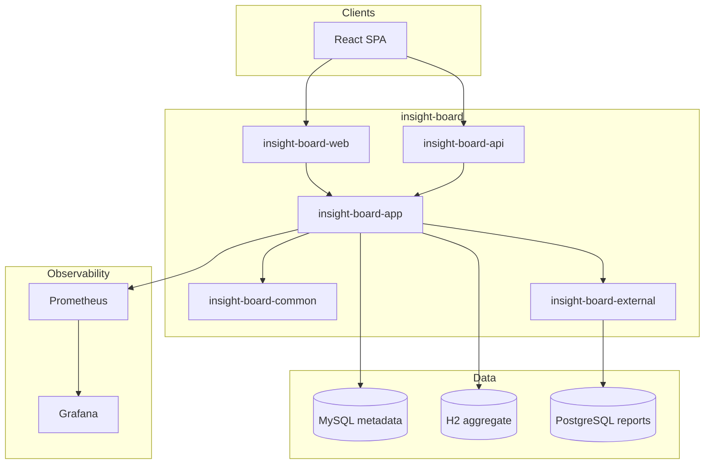

# Insight Board 현대화 로드맵

## 프로젝트 명명 제안

| 구분 | 제안 | 근거 |
|------|------|------|
| Git 저장소 | `insight-board` | BI/인사이트 보드 목적이 명확하고, 패키지·모듈 접두어와 일치 |
| Maven/Gradle 루트 | `insight-board` | |
| Java 패키지 | `com.katsulab.insightboard` | 조직 도메인 + 제품명. **레이어별 하위 패키지** 권장 (아래 참고) |
| 컨텍스트 경로 | `/insight-board` 또는 `/api/v1` | 기존 `/bdp` 와 병행 기간 두고 점진 전환 |

### 패키지 구조 (Clean Architecture)

```
com.katsulab.insightboard
├── domain          # 엔티티, 도메인 서비스, 포트(인터페이스)
├── application     # 유스케이스, DTO, 트랜잭션 경계
├── adapter
│   ├── in.web      # Spring MVC / REST (기존 org.cboard.controller 대체)
│   ├── in.api      # OpenAPI REST 전용
│   ├── out.persistence  # MyBatis/JPA 구현
│   └── out.external     # Presto, Redis, 메일, owlnest 등
└── config          # Spring @Configuration
```

멀티모듈(Maven/Gradle):

| 모듈 | 역할 |
|------|------|
| `insight-board-common` | 공통 DTO, 유틸, 예외, 보안 상수 |
| `insight-board-domain` | 도메인 + 포트 (프레임워크 무의존) |
| `insight-board-api` | REST API, OpenAPI, actuator 노출 |
| `insight-board-web` | React 정적 리소스 서빙, SPA fallback |
| `insight-board-external` | 레거시/외부 시스템 어댑터 (owlnest, JDBC 드라이버) |
| `insight-board-app` | Spring Boot 메인, 설정 조립 |

---

## 1. 레거시 기술 스택 분석

### 백엔드

| 영역 | 현재 | 리스크 |
|------|------|--------|
| 언어 | Java 8 (소스), Java 21 런타임 혼용 | 모듈/리플렉션 이슈 |
| 프레임워크 | Spring 4.3.7, Spring Security 4.1 | CVE, Java 17+ 비호환 |
| 빌드 | Maven WAR | 클라우드 네이티브 배포 불리 |
| ORM | MyBatis 3.1 + XML mapper | 유지보수 가능, 버전 구식 |
| 보안 | 커스텀 SDII 필터, SHA-256 비밀번호 | 표준 OAuth2/JWT 미적용 |
| 캐시 | Ehcache 3 | Redis 프로파일은 주석 처리 |
| 스케줄 | Quartz 2.2 | Spring Boot `@Scheduled` 또는 별도 워커 검토 |
| DB | MySQL 메타 + PostgreSQL 리포트 + H2 집계 | 환경별 설정 분산 |
| 프론트 (내장) | JSP + AngularJS 1.x + AdminLTE/Bootstrap 3 | EOL, SPA 전환 필요 |

### 프론트 (cboard 내재)

- `src/main/webapp/cboard/`: AngularJS 모듈, ECharts, jQuery 플러그인
- 디자인: AdminLTE CSS, `main.css` — **유지 대상**
- 교체 대상: AngularJS → React, 빌드 체인 없음 → Vite/Webpack

### 인프라/운영

- Log4j 1.x, Tomcat 7/8 Dockerfile (CentOS 6)
- Actuator/Prometheus/Grafana **미구성**

---

## 2. 목표 아키텍처



---

## 3. 단계별 실행 계획

### Phase 0 — 검증 (완료/진행)

- [x] H2 로컬 프로파일 (`-Denv=local`)
- [x] dev 로그인 (`SY` / `000admin` / `qwerty!23`)
- [x] WAR 빌드 및 Tomcat 기동
- [x] 데모 영상·실행 문서

### Phase 1 — 백엔드 현대화 기반

1. 루트 `pom.xml` → `insight-board` parent POM (Java **21**, Spring Boot **3.4.x**)
2. `org.cboard` → `com.katsulab.insightboard` 점진 이전 (Strangler Fig)
3. Spring Security 6: form login 또는 JWT (dev profile 유지)
4. MyBatis 3.5+ / Spring Boot starter
5. `application-local.yml` — H2/Testcontainers 프로파일

### Phase 2 — 관측성

```yaml
# 목표 의존성
spring-boot-starter-actuator
micrometer-registry-prometheus
```

- Prometheus scrape: `/actuator/prometheus`
- Grafana 대시보드: JVM, HTTP, Druid/Hikari CP, 커스텀 비즈니스 메트릭
- `docker-compose.observability.yml` (Prometheus + Grafana)

### Phase 3 — 프론트 (React, 디자인 유지)

1. `frontend/` — Vite + React 19 + TypeScript
2. 기존 CSS 복사: `cboard/css`, AdminLTE, Bootstrap 3 클래스명 유지 또는 CSS Modules 로 래핑
3. AngularJS 컨트롤러/서비스 → React hooks + React Query
4. ECharts: `echarts-for-react` (차트 옵션 JSON 마이그레이션)
5. API 베이스 URL: `/api/v1` (기존 `.do` 엔드포인트 어댑터 레이어)

**원칙**: HTML/CSS 레이아웃·색상·간격은 최대한 동일, **프레임워크·번들러만 교체**.

### Phase 4 — 멀티모듈 Clean Architecture

위 모듈 표대로 분리, `domain` 은 Spring 의존 제거, 테스트는 `domain` 단위 JUnit 5.

### Phase 5 — 언어/런타임 마이그레이션 가이드

별도 문서 `docs/MIGRATION_GUIDES.md` 에 정리 예정:

| 대상 | 전략 |
|------|------|
| **Kotlin** | `insight-board-api` 부터 신규 코드 Kotlin, Java 상호운용, coroutines 는 외부 호출에만 |
| **Python** | ML/리포트 배치 → FastAPI 사이드카, gRPC/REST 로 `external` 모듈 연동 |
| **Node** | BFF 또는 실시간(WS) — React dev server 프록시, 운영은 web 모듈 정적 서빙 |

---

## 4. 브랜치 전략

| 브랜치 | 용도 |
|--------|------|
| `modern/main` | 현대화 기준선 |
| `cursor/cboard-verification-and-modernization-869c` | 로컬 검증 + 문서 |
| `cursor/insight-board-boot3-*` | Spring Boot 3 스캐폴드 (다음 PR) |

---

## 5. 리스크 및 의사결정

1. **owlnest JAR**: 스텁 제거 전 사설 아티팩트 저장소 필수
2. **Shinhan 커스텀 로그인**: 표준 OIDC 전환 시 `SDII*` 필터 제거 계획 필요
3. **PostgreSQL 리포트 SQL**: H2 스텁으로는 통합 테스트 불가 → Testcontainers PostgreSQL
4. **패키지 rename**: Big Bang 보다 모듈 단위 Strangler 권장

---

## 6. 즉시 후속 작업 (권장 PR 순서)

1. Spring Boot 3 멀티모듈 스켈레톤 (`insight-board-*`, 빈 컨트롤러 + actuator)
2. `org.cboard` 패키지 복사 → `com.katsulab.insightboard.adapter.in.web` 이전 PR
3. React `frontend/` 스캐폴드 + login/starter 화면 POC (CSS 동일)
4. `docker-compose.yml` (MySQL + Prometheus + Grafana)
5. `docs/MIGRATION_GUIDES.md` (Kotlin/Python/Node)
