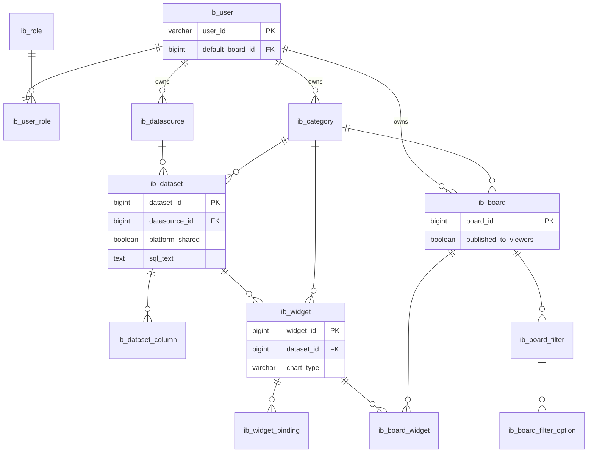

# Insight Board — DB Schema v2 (전면 리뉴얼)

> Flyway: `V11__schema_v2_renewal.sql`  
> 레거시 `dashboard_*` 제거 → `ib_*` (Insight Board) 메타 스키마

## 설계 원칙

1. **그래프·집계에 필요한 관계는 컬럼/FK** — `dataset_id`, `datasource_id`, `widget_binding`, `board_widget`
2. **JSON은 최소** — JDBC `config_json`, 차트 스타일 `options_json`, 보드 **배치** `layout_json` 만
3. **API 호환** — 프론트/집계 엔진이 기대하는 CBoard형 `data_json` 은 저장 시 분해·조회 시 `Cboard*Json` 브릿지로 조립
4. **RBAC** — `published_to_viewers`, `default_board_id`, `platform_shared` (Dataset)

## 역할

| role_id | 이름 | 용도 |
|---------|------|------|
| 1 | Super Admin | DataSource·Dataset·Users |
| 2 | Viewer | 게시된 Board 조회만 |
| 3 | Manager | Widget·Board·Category, Board 게시 |

## ERD



## 레거시 대응

| v1 | v2 |
|----|-----|
| `dashboard_user` | `ib_user` |
| `dashboard_role` | `ib_role` |
| `dashboard_datasource` | `ib_datasource` |
| `dashboard_dataset.data_json` | `ib_dataset` + `ib_dataset_column` + 브릿지 |
| `dashboard_widget.data_json` | `ib_widget` + `ib_widget_binding` + `options_json` |
| `dashboard_board.layout_json` | `ib_board.layout_json` + `ib_board_widget` |
| `dashboard_role_res` | **삭제** → `published_to_viewers` |
| `dashboard_job`, `dashboard_board_param` | **삭제** |

## 데모 물리 테이블

`V3`/`V7`의 `sales_fact_sample_flat` 등은 **유지** (DataSource JDBC가 참조).

## 코드 마이그레이션 상태

- [x] V11 Flyway
- [x] MyBatis → `ib_*` 테이블
- [x] Dataset/Widget Repository + JSON 브릿지
- [x] Board layout ↔ `ib_board_widget` (저장 시 sync, 조회 시 layout 비어 있으면 복원)
- [x] API `ListBoards` Viewer 필터 (`published_to_viewers`)
- [x] API `GetBoard` Viewer 미게시 보드 404
- [x] Board 저장 `publishedToViewers` + 세션 `defaultBoardId`
- [x] 프론트: Viewer 홈/사이드바, Manager 게시 체크박스, 설정 라우트 가드
- [x] V12 Chart Gallery `layout_json` + demo 위젯 시드
- [x] V13 Chart Gallery 전체 `demo_*` 위젯 시드
- [x] `layout_json` param row ↔ `ib_board_filter` 동기화
- [ ] 프론트 구조화 API (`/api/v2/...`) — 선택

## 로컬 DB 재적용

```bash
# H2 파일 DB 초기화 후
rm -rf target/h2-local
./gradlew :modules:api:bootRun --args='--spring.profiles.active=local-h2'
```

PostgreSQL은 볼륨 초기화 또는 수동 `V11` 적용 필요.
